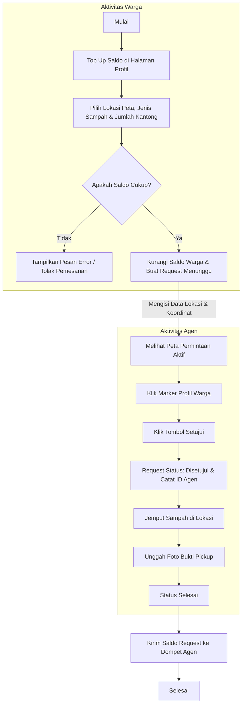

# Bank Sampah Digital (Sampah Bank)

Platform digital berbasis web yang menghubungkan warga dengan agen pengangkut sampah terpercaya untuk mengelola pembuangan sampah berbayar dengan sistem mirip ojek online (escrow saldo).

---

## 📖 Gambaran Umum
Website **Bank Sampah Digital** ini dikembangkan menggunakan framework Laravel 11. Platform ini bertujuan untuk memudahkan penanganan sampah rumah tangga dengan cara yang menguntungkan bagi kedua belah pihak (warga dan agen). 

* **Warga (User)** dapat mengajukan permintaan penjemputan (*request pickup*) sampah dengan menentukan titik lokasi jemput lewat peta Leaflet.js, memilih jenis sampah, serta menentukan kuantitas (jumlah kantong). Pembayaran dilakukan melalui saldo warga yang langsung terpotong saat pesanan dikirim.
* **Agen (Admin)** dapat memantau pesanan penjemputan terdekat di peta, menyetujui pesanan, melakukan penjemputan fisik, dan mengunggah foto bukti penyelesaian. Saldo pembayaran dari warga akan langsung ditransfer ke dompet agen begitu pesanan selesai diverifikasi.

---

## 🛠️ Fitur Utama
1. **Autentikasi & Proteksi Akses (Middleware)**
   * Pembagian rute dan hak akses yang ketat antara warga (`role: user`) dan agen (`role: admin`). Warga tidak bisa mengakses dashboard agen `/agen` begitupun sebaliknya.
   * Auto-generate username unik dan penentuan avatar default saat registrasi.
2. **Sistem E-Wallet (Saldo Dompet)**
   * **Warga**: Dapat melakukan *Top Up* saldo secara asinkron (AJAX Fetch) di halaman profil dengan pilihan nominal instan atau nominal kustom.
   * **Transaksi Berbayar**: Pemotongan saldo warga secara langsung saat pesanan diajukan untuk memvalidasi ketersediaan dana (escrow).
   * **Agen**: Memiliki dompet saldo agen untuk menampung pendapatan hasil angkut sampah. Saldo otomatis bertambah sesaat setelah bukti penjemputan dikirim.
3. **Peta Interaktif Leaflet.js**
   * **Warga**: Menentukan titik jemput secara akurat dengan menggeser pin merah di peta.
   * **Agen**: Melihat semua titik permintaan penjemputan warga yang aktif di peta dengan penanda (*marker*) kustom berupa foto profil dari warga yang bersangkutan.
4. **Detail & Bukti Penjemputan**
   * Halaman unggah bukti foto bagi agen lengkap dengan fitur interaktif *Drag-and-Drop* file gambar dan preview instan.
5. **Clean Code (Pemisahan Aset)**
   * Mengikuti arsitektur clean code dengan memisahkan inline style (CSS) dan inline script (JS) dari file Blade utama ke folder aset publik (`public/css/` dan `public/js/`).

---

## 📊 Flowchart Transaksi & Saldo

Berikut adalah visualisasi alur pembuatan transaksi dan perputaran saldo pada sistem Bank Sampah Digital:



---

## 🏷️ Tarif Sampah per Kantong
Tarif kalkulasi saldo dihitung berdasarkan jenis sampah yang disetor per satu kantong plastik:

| Jenis Sampah | Tarif per Kantong |
| :--- | :--- |
| **Plastik** | Rp 5.000 |
| **Kertas** | Rp 4.000 |
| **Logam** | Rp 10.000 |
| **Makanan / Organik** | Rp 2.000 |

---

## 🚀 Cara Menjalankan Project

Ikuti langkah-langkah berikut untuk menjalankan project di komputer lokal Anda:

1. **Clone repository dan masuk ke folder project**
2. **Instal dependensi PHP & JavaScript**
   ```bash
   composer install
   npm install
   ```
3. **Duplikat file konfigurasi environment**
   ```bash
   cp .env.example .env
   ```
4. **Generate App Key**
   ```bash
   php artisan key:generate
   ```
5. **Jalankan Migrasi Database (SQLite default)**
   ```bash
   php artisan migrate
   ```
6. **Jalankan Server Lokal**
   ```bash
   php artisan serve
   ```
7. **Akses di Browser**
   Buka alamat [http://127.0.0.1:8000](http://127.0.0.1:8000) pada browser Anda.
